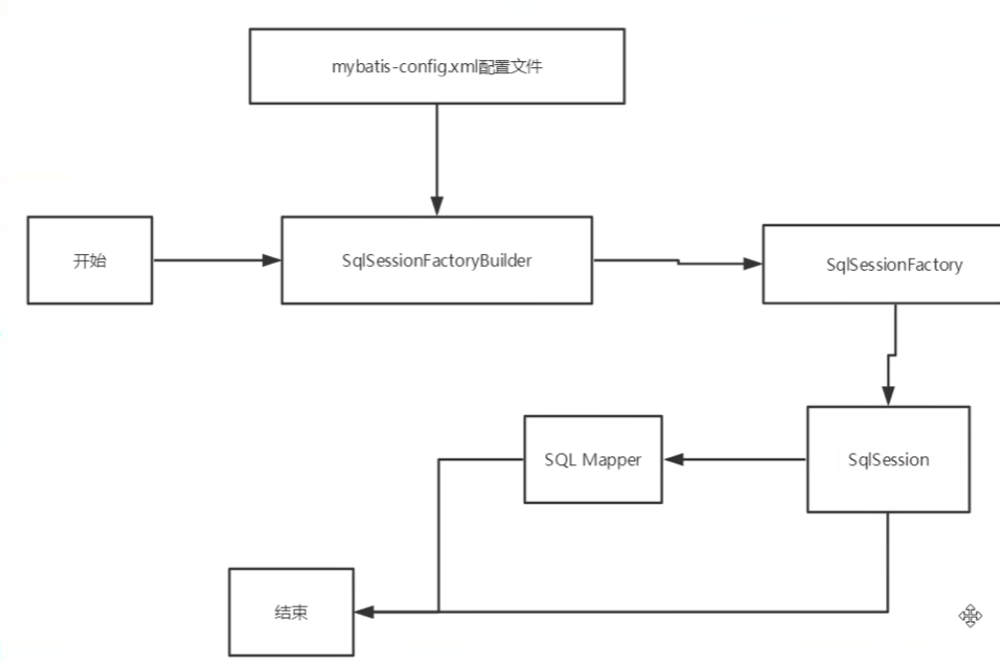

# mybatis-demo
一、新建数据库
二、新建项目
1.新建一个maven项目
2.删除src目录
3.导入maven依赖（基础工程搭建完成）
4.创建一个模块（module）
三、创建一个模块
1. 编写mybatis的核心配置文件(链接数据库)
2. 编写mybatis工具类
   四、编写代码
3. 实体类（pojo）
4. dao接口
5. 接口实现类（UserMapper.xml，由原来的UserDaoImpl转变为一个Mapper配置文件）
6. 测试（junit）
   常见问题：
   1. Error parsing SQL Mapper Configuration. Cause: java.io.IOException: Could not find resource com/ling/dao/UserMapper.xml

    因为maven由于他的约定大于配置，我们之后可能遇到，我们写的配置文件，无法被导出或者生效的问题，
    解决方案：再build中配置resources，来防止我们资源导出失败的问题
    ```xml
     <build>
            <resources>
                <resource>
                    <directory>src/main/resources</directory>
                    <includes>
                        <include>**/*.properties</include>
                        <include>**/*.xml</include>
                    </includes>
                    <filtering>true</filtering>
                </resource>
                <resource>
                    <directory>src/main/java</directory>
                    <includes>
                        <include>**/*.properties</include>
                        <include>**/*.xml</include>
                    </includes>
                    <filtering>true</filtering>
                </resource>
            </resources>
        </build>
    
    ```
   2. 数据库链接失败
      数据库的链接 方式由 useSSL=true 变成 useSSL=false
## 配置解析
   1. 核心配置文件
      1. mybatis-config.xml
      2. mybatis的配置
   2. 环境配置
      1. mybatis可以配置成适应多种环境
      2. 尽管可以配置多个环境，但每个sqlSessionFactory实例只能选择一种环境
      3. mybatis默认的事务管理器是JDBC(这个配置直接使用了 JDBC 的提交和回滚设施，它依赖从数据源获得的连接来管理事务作用域。)
      4. mybatis默认的链接是POOLED（这种数据源的实现利用“池”的概念将 JDBC 连接对象组织起来，避免了创建新的连接实例时所必需的初始化和认证时间。 这种处理方式很流行，能使并发 Web 应用快速响应请求。）
   3. 属性
       1. 这些属性可以在外部进行配置，并可以进行动态替换。你既可以在典型的 Java 属性文件中配置这些属性，也可以在 properties 元素的子元素中设置
       2. 编写配置文件(db.properties)
       3. 再核心配置文件中引入！！！！！（重点）也可以再其中增加引用配置，如果两个一样字段，优先使用外部配置
   
   4. 设置
      1. cacheEnabled	全局性地开启或关闭所有映射器配置文件中已配置的任何缓存。
      2. lazyLoadingEnabled	延迟加载的全局开关。当开启时，所有关联对象都会延迟加载。 特定关联关系中可通过设置 fetchType 属性来覆盖该项的开关状态。
      3. logImpl	指定 MyBatis 所用日志的具体实现，未指定时将自动查找。
   5. 映射
      1. 映入接口的实现类（UserMapper.xml）
   6. 生命周期
      1. 生命周期和作用域是至关重要的，因为错误的使用会导致非常严重的并发问题
      
      2. sqlSessionFactoryBuilder
         1. 一旦创建了sqlSessionFactory，就不再需要它了
         2. 局部变量
      3. sqlSessionFactory
         1. 说白了就是可以想象为，数据库连接池
         2. sqlSessionFactory一旦被创建就应该再应用的运行期间一直存在，**没有任何理由丢弃它或重新创建一个实例**
         3. 因此sqlSessionFactory的最佳作用域是应用作用域。
         4. 最简单的就是使用单例模式或者静态单例模式
      4. sqlSession
         1. 链接到连接池的一个请求
         2. sqlSession的实例不是线程安全的，因此是不能被共享的，所以它的最佳作用域是请求或方法作用域
         3. 用完之后需要赶紧关闭，否则资源被占用
      
   7. 解决属性名和字段名不一致的问题
      1. 解决方法，起别名（sql中起别名，与属性对应）
      2. UserMapper.xml中的 resultType="user" 改为  resultMap="UserMap",并设置相对应的映射

### 日志

   1. logImpl 默认实现使用的是“STDOUT_LOGGING”
   2. 日志配置更灵活使用：LOG4J

## 使用注解开发

```java
// dao/UserMapper
  @Insert("insert into user(id,name,pwd) values (#{id}, #{name}, #{pwd})")
 int addUser(User user);

```

```xml
# mybatis-config.xml
<!--   3. 绑定接口 -->
<mapper class="com.ling.dao.UserMapper"/>
```

```java
//test
public class UserMapTest {

    @Test
    public void test(){
        SqlSession sqlSession = MybatisUtils.getSqlSession();
        UserMapper userMapper = sqlSession.getMapper(UserMapper.class);
        List<User> users = userMapper.getUsers();
        for (User user : users) {
            System.out.println(user);
        }
        User user1 = userMapper.getUserById(1);
        System.out.println(user1);


        userMapper.addUser(new User(3,"zhangsan","1234444"));

        sqlSession.close();
    }
}
```
## Lmbok

```
@Getter and @Setter
@FieldNameConstants
@ToString
@EqualsAndHashCode
@AllArgsConstructor, @RequiredArgsConstructor and @NoArgsConstructor
@Log, @Log4j, @Log4j2, @Slf4j, @XSlf4j, @CommonsLog, @JBossLog, @Flogger, @CustomLog
@Data
@Builder
@SuperBuilder
@Singular
@Delegate
@Value
@Accessors
@Wither
@With
@SneakyThrows
@val
@var
experimental @var
@UtilityClass
Lombok config system
Code inspections
Refactoring actions (lombok and delombok)

```
1. @Data：无参数构造、get、set、tostring、hashcode、equals
2. @AllArgsConstructor 
3. NoArgsConstructor 无参数构造
4. @ToString
5. @Getter and @Setter


使用步骤：
1. idea中安装插件Lombok
2. 引入jar包
```xml
 <dependencies>
        <!-- https://mvnrepository.com/artifact/org.projectlombok/lombok -->
        <dependency>
            <groupId>org.projectlombok</groupId>
            <artifactId>lombok</artifactId>
            <version>1.18.22</version>
            <scope>provided</scope>
        </dependency>
    </dependencies>

```
3. 实体类上加注解即可
```java
@Data
@AllArgsConstructor
```

## 一对多、多对一
### 多对一（mybatis-06）
1. 子查询
```xml
<?xml version="1.0" encoding="UTF-8" ?>
<!DOCTYPE mapper
        PUBLIC "-//mybatis.org//DTD Mapper 3.0//EN"
        "http://mybatis.org/dtd/mybatis-3-mapper.dtd">
<mapper namespace="com.ling.dao.StudentMapper">
<!--        <select id="getStudents" resultType="student">-->
<!--                select * from student;-->
<!--        </select>-->
<!--    思路：
            1. 查询所有的学生信息
            2. 根据查询出来的学生信息tid，寻找对应的老师 子查询
-->

        <select id="getStudents" resultMap="StudentTeacher">
                select * from student;
        </select>
        <resultMap id="StudentTeacher" type="student">
                <result property="id" column="id"/>
                <result property="name" column="name"/>
<!--                复杂的属，我们需要单独处理 对象(多对一、一对一) ：association ； 集合(一对多)：collection-->
                <association property="teacher" column="tid" javaType="Teacher"  select="getTeacher" />

        </resultMap>
        <select id="getTeacher" resultType="Teacher">
                select * from teacher where id = #{tid}
        </select>

</mapper>
```
2. 嵌套查询
```xml
<?xml version="1.0" encoding="UTF-8" ?>
<!DOCTYPE mapper
        PUBLIC "-//mybatis.org//DTD Mapper 3.0//EN"
        "http://mybatis.org/dtd/mybatis-3-mapper.dtd">
<mapper namespace="com.ling.dao.StudentMapper">
    <select id="getStudents2" resultMap="StudentTeacher2">
        select s.id sid,s.name sname, t.name tname from
        student s ,teacher t where s.tid = t.id;
    </select>
    <resultMap id="StudentTeacher2" type="student">
        <result property="id" column="sid"/>
        <result property="name" column="sname" />
        <association property="teacher" javaType="Teacher">
            <result property="name" column="tname"/>
        </association>

    </resultMap>

</mapper>
```

### 一对多（ 一个老师对多个学生）

mybatis-07

1. 嵌套
```xml
<?xml version="1.0" encoding="UTF-8" ?>
<!DOCTYPE mapper
        PUBLIC "-//mybatis.org//DTD Mapper 3.0//EN"
        "http://mybatis.org/dtd/mybatis-3-mapper.dtd">
<mapper namespace="com.ling.dao.TeacherMapper">
<!--    <select id="getTeacherList" resultType="teacher">-->
<!--    select * from teacher;-->
<!--    </select>-->

    <select id="getStudentByTeacher" resultMap="StudentTeacher">
        select s.id sid,s.name sname, t.name tname,t.id tid from
          student s ,teacher t where s.tid = t.id and t.id=#{tid};
    </select>
    <resultMap id="StudentTeacher" type="teacher">
        <result property="id" column="tid"/>
        <result property="name" column="tname" />
<!--        teacher实体类中定义的学生参数名，注意一一对应-->
        <collection property="students" ofType="student">
            <result property="id" column="sid"/>
            <result property="name" column="sname"/>
            <result property="tid" column="tid"/>
        </collection>

    </resultMap>


</mapper>
```
2. 子查询
```xml
<?xml version="1.0" encoding="UTF-8" ?>
<!DOCTYPE mapper
        PUBLIC "-//mybatis.org//DTD Mapper 3.0//EN"
        "http://mybatis.org/dtd/mybatis-3-mapper.dtd">
<mapper namespace="com.ling.dao.TeacherMapper">
<!--子查询-->
    <select id="getStudentByTeacher2" resultMap="StudentTeacher2">
        select * from teacher where id = #{tid};
    </select>
    <resultMap id="StudentTeacher2" type="teacher">
        <result property="id" column="id"/>
        <result property="name" column="name"/>
        <!--                复杂的属，我们需要单独处理 对象(多对一\一对一) ：association ； 集合(一对多)：collection-->
        <collection property="students"  ofType="ArrayList" select="getStudentByTid" column="id"/>

    </resultMap>
    <select id="getStudentByTid" resultType="Student">
        select * from student where tid = #{tid}
    </select>
</mapper>
```
 3. 小结
    1. 关联 - association 【多对一】
    2. 集合 - collection   [一对多]
    3. javaType   & ofType
       1. javaType （Teacher-association）用来指定实体类中属性的类型
       2. ofType （ArrayList-collection）用户指定映射到List或者集合中的pojo类型（映射到pojo中的List或者集合类型？），泛型中的约束型
    4. 注意点：
       1. 保证sql的可读性，尽量保证同属易懂
       2. 注意一对多和多对一中，属性名和字段的问题
       3. 如果问题不好排查，可以使用日志，建议使用log4j
       4. 建议：先把sql写好，测试效率(EXPLAIN)，在套到xml中


## mysql回顾
1. 创建外建
使用的本地数据库test
```sql
-- 创建外建
-- 为表(students)中字段(tid)添加外键，并指定外键名为(teacher_id_key)
alter table students add constraint teacher_id_key foreign key (tid) references teacher(id);
-- 为表(students)中字段(tid)添加外键，不指定外键名，由数据库自动生成外键名
alter table students add foreign key (tid) references teacher(ID);

-- 删除外建
-- 通过修改列的属性来删除自增长，第一个(ID)为原列名，第二个(id)为新列名
alter table students change id id int not null;
-- 删除表(students)中的主键约束，如果主键列为自增列，则需要先删除该列的自增长
alter table students drop primary key;

-- 删除表(students)中的名称为(teacher_id_key)的外键
alter table students drop foreign key teacher_id_key;

```
2. 主外键关系的约束 

    2.1 如果子表试图创建一个在主表中不存在的外键值，数据库会拒绝任何insert或update操作。

    2.2 如果主表试图update或者delete任何子表中存在或匹配的外键值，最终动作取决于外键约束定义中的on delete和on update选项。
    
   2.3  on delete和on update都有下面四种动作。 
   1. cascade：主表删除或更新相应的数据行，则子表同时删除或更新与主表相匹配的行，即级联删除、更新。 
   2. set null：主表删除或更新相应的数据和，则子表同时将与主表相匹配的行的外键列置为null。当外键列被设置为not null时无效。 
   3. no action：数据库拒绝删除或更新主表。 
   4. restrict：数据库拒绝删除或更新主表。如果未指定on delete或on update的动作，则on delete或on update的默认动作就为restrict。

3. 设置外键约束的动作选项(添加新的外键约束，增加ON DELETE CASCADE)
```sql
ALTER TABLE students 
  ADD CONSTRAINT `teacher_id_key`
  FOREIGN KEY (`tid` )
  REFERENCES teacher (`id` )
  ON DELETE CASCADE
  ON UPDATE RESTRICT;
```


